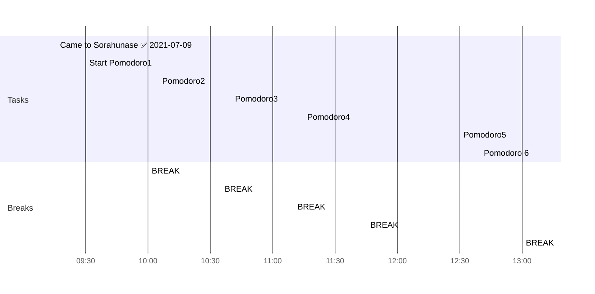

## 09-07-2021

> One voice can change a room, and if one voice can change a room, then it can change a city, and if it can change a city, it can change a state, and if it change a state, it can change a nation, and if it can change a nation, it can change the world. Your voice can change the world.
> &mdash; <cite>Barack Obama</cite>

```todoist
{
"name": "Yesterday's tasks and overdue",
"filter": "2021-07-08 | overdue",
"sorting": ["priority"]
}
```


```todoist
{
"name": "Today's tasks and overdue",
"filter": "2021-07-09",
"sorting": ["priority"]
}
```


```todoist
{
"name": "Tomorrow's tasks",
"filter": "2021-07-10",
"sorting": ["priority"]
}
```
## Today's planning
## Day Planner


#### Morning Routine
- [x] 09:16 Came to Sorahunase ✅ 2021-07-09
- [x] 09:30 Start Pomodoro1
- [x] 10:00 BREAK
- [x] 10:05 Pomodoro2
- [x] 10:35 BREAK
- [x] 10:40 Pomodoro3
- [x] 11:10 BREAK


- [ ] 11:15 Pomodoro4
- [ ] 11:45 BREAK
### Long Break
- [ ] 12:30 Pomodoro5
- [ ] 13:00 BREAK
- [ ] 13:05 Pomodoro 6


Let's take a break